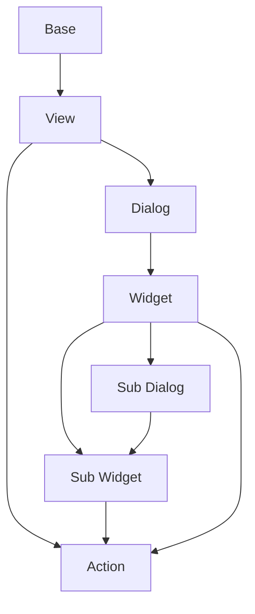

# Documentation
decore Base ist ein "Python to Vue.js"-Open-Source-Paket, das Ihnen hilft, in wenigen einfachen Schritten von der Idee zur Ansicht zu gelangen. Es richtet sich an diejenigen, die sich auf die Ergebnisse ihrer Algorithmen konzentrieren , wissenschaftlich arbeiten wollen, oder Lehr- bzw. Lernfunktionen ausüben.

[](https://ko-fi.com/P5P2JCC5B)

**decore Base ist im Moment noch in Arbeit, nur für Windows verfügbar und noch nicht bereit für die Produktion.**

Die empfohlene IDE ist Visual Studio Code und alle meine Ausführungen und Dokumentationen werden sich hier auch nur auf vscode beziehen.

[Einsicht in den derzeitigen Vortschritt des decore Projektes](https://github.com/users/KemoPanzah/projects/1/views/1)

## Contribution
Die größte Hilfe die ich derzeit bekommen kann ist, wenn ihr Euch das Projekt anschaut und mir eure Meinung dazu mitteilt. Ich bin für jede Kritik dankbar. 

Meine aktuelles Beispielprojekt ist direkt im Python-Paket enthalten. Um die Beispielanwendung zu installieren, seht bitte in der Dokumentation unter **Sample** nach. Bitte erst **Installation**, **Usage** und **Preperation** lesen.

Alles was an Features, Fehler oder Unklarheiten in der Dokumentation gefunden wird, bitte ich euch mir mitzuteilen.

[Nutz dafür bitte den Issues-Bereich im Repository.](https://github.com/KemoPanzah/decore_Base/issues)

## Get started
### Installation
Erstellen Sie ein leerers Python-Projekt in Ihrem gewünschten Verzeichnis. Dieses Verzeichnis bezeichne ich im weitern Verlauf dieser Dokumentation als **Projektstammverzeichnis**.

Um decore Base zu installieren führen Sie folgenden Befehl in ihrem Projektstammverzeichnis aus. Verwenden Sie das Terminal in vscode.

```python
pip install decore-Base
```

Dazu wird ein aktivierter Python Interpreter benötigt! Um mehr über Python Interpreter zu erfahren, besuchen Sie [Python Interpreter](https://code.visualstudio.com/docs/python/environments).

### Usage
Erstellen Sie eine neue Datei mit dem Namen `app.py` in Ihrem Projektstammverzeichnis.

Um decore Base zu verwenden, importieren Sie es in Ihr Projekt:

```python
from decore_base import decore
```

Üblicherweise enthält ein Python Main-Modul eine Abfrage, die prüft, ob es sich um das Hauptmodul handelt, und dann die Funktion `main()` aufruft.

Wir erstellen als nächstes eine Zeile `if __name__ == '__main__':` in der Datei app.py.

Um eine neue Decore-Anwendungsinstanz zu erstellen, verwenden Sie eine `@decore.app` dekorierte Funktion in der Datei app.py nach der Zeile `if __name__ == '__main__':`.

```python
if __name__ == '__main__':
    @decore.app(p_title='My App')
    def main():
        pass
```

Ein Beispiel dafür finden Sie hier:

https://github.com/KemoPanzah/decore_Base/blob/master/decore_base/sample/app.py

### Preperation
Der Vorbereitungsbefehl erstellt alle benötigten Hilfsdateien in Ihrem Projektstammverzeichnis.

Um Ihre Anwendung vorzubereiten, führen Sie `python app.py prepare` in Ihrem Projektstammverzeichnis aus. Verwenden Sie das Terminal in vscode.

### Development
Um Ihre Anwendung zu entwickeln, verwenden Sie Ihren Debugger mit dem Profil `[dev] decore Base development` in vscode.

Öffnen Sie den Browser und geben Sie `http://localhost:5555` ein.

### Run
Um Ihre Anwendung zu starten, führen Sie `python app.py` in Ihrem Projektstammverzeichnis aus. Verwenden Sie das Terminal in vscode.

Öffnen Sie den Browser und geben Sie `http://localhost:5555` ein.

<!-- ### Build
Um Ihre Anwendung zu erstellen, verwenden Sie Ihren Debugger mit dem Profil `[bld] decore Base build` in vscode. -->

## Sample
Um die Funktionsweise von Decore base zu verstehen, ist es am besten, sich die Sample-Anwendung anzuschauen. Die Anwendung repräsentiert meine ständige Weiterentwicklung von decore Base.

https://github.com/KemoPanzah/decore_Base/tree/master/decore_base/sample

Um die Sample-Anwenundung in einen Unterordner des Projektstammverzeichnis zu synchronisieren, führen Sie `python app.py sample` in Ihrem Projektstammverzeichnis aus. Verwenden Sie das Terminal in vscode.

Um die Sample-Anwendung nach dem Synchronisieren zu starten, verwenden Sie Ihren Debugger mit dem Profil `[smp] decore Base sample` in vscode.

## Erläuterungen

#### Base
Die Base ist im prinzip das Trägerelement für Views. Sie kann Views von derselben Base oder Views von anderen Base aufnehmen. Die Base ist immer mit einem Model verknüpft.

#### Model
Das Model definiert die Daten mit denen gearbeitet wird. Jedes Model ist mit einer Base verknüpft und basiert auf peewee ORM. Um mehr über peewee ORM zu erfahren, besuchen Sie [peewee](http://docs.peewee-orm.com/en/latest/).

## Api reference
Um eine GUI mit decore Base zu erstellen, dekoriert man Funktionen im Quellcode nach der Vorgabe des Abarbeitungsprozesses. welches vorher mit `from decore_base import decore` importiert werden muss.

Das decore Modul enthält jene Funktionen die bei der Erstellung der Metadaten für die decore Front Applikation benötigt werden.

Um die allgemeine Herangehensweise zu verstehen synchronisieren Sie sich die Sample Applikation mit dem Befehl `python app.py sample` in Ihrem Projektstammverzeichnis.

### @decore.app()
### @decore.base()
### @decore.view()
### @decore.dialog()
### @decore.widget()
### @decore.action()

## Model reference
Um die Arbeit mit dem originalen Peewee-Model noch weiter zu vereinfachen, wurde das Model um einige funktionen erweitert.

!BESCHREIBUNG FOLGT!

## Component processing


# Notes
Diese Dokumentation wurde mit Github Copilot aus dem deustchen ins englische übersetzt.