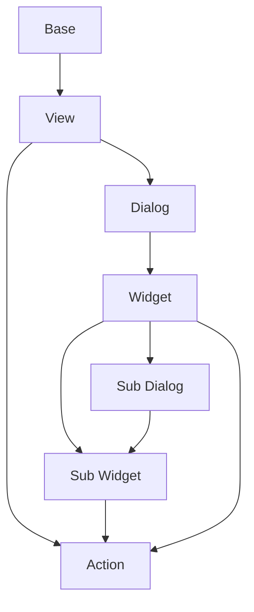

# Documentation
decore Base is an out-of-the-box "Python to Vue.js" data application dashboard that helps you go from idea to view in a few simple steps. It is aimed at those who want to focus on the results of their algorithms , do scientific work, or perform teaching or learning functions.

[](https://ko-fi.com/P5P2JCC5B)

**decore Base is currently a work in progress, only locally deployable, only available for Windows and not yet ready for production.**

The recommended IDE is Visual Studio Code and all my comments and documentation here will also refer to vscode only.

[Insight into the current progress of the decore project](https://github.com/users/KemoPanzah/projects/1/views/1)

## Contribution
The biggest help I can get right now is if you take a look at the project and tell me what you think. I am grateful for any criticism.

My current sample project is included directly in the Python package. To install the sample application, please see the documentation under **Sample**. Please read **Installation**, **Usage** and **Preperation** first.

Everything that is found in features, bugs or unclear in the documentation, I ask you to let me know.

[Please use the Issues area in the repository for this.](https://github.com/KemoPanzah/decore_Base/issues)

## Get started
### Installation
Create an empty Python project in your desired directory. I will refer to this directory as **project root directory** in the following course of this documentation.

To install decore Base, run the following command in your project root directory. Use the terminal in vscode.

```python
pip install decore-Base
```

This requires an activated Python Interpreter! To learn more about Python Interpreters, visit [Python Interpreter](https://code.visualstudio.com/docs/python/environments).
### Preperation
Create a new file named `app.py` in your project root directory.

To use decore Base, import it into your project. 

```python
from decore_base import decore
```

You then use the prepare command to create all the auxiliary files you need in your project root directory.

To prepare your application, run `python app.py --prepare` in your project root directory. Use the terminal in vscode.

### Usage
To allow the Python interpreter to process the future base classes, add the following import.

```python
from bases import *
```

Typically, a Python main module contains a query that checks whether it is the main module, and then calls the `main` function.

We next create a line `if __name__ == '__main__':` in the app.py file.

To create a new Decore application instance, use a `@decore.app` decorated ˋmainˋ function in the app.py file after the line `if __name__ == '__main__':`.

```python
from decore_base import decore
from bases import *

if __name__ == '__main__':
    @decore.app(p_title='My App')
    def main():
        pass
```

You can find an example here:

https://github.com/KemoPanzah/decore_Base/blob/master/decore_base/sample/app.py

### Development
To develop your application, use your debugger with the `[dev] decore base development` profile in vscode.

Open the browser and type `http://localhost:5555`.

### Run
To start your application, run `python app.py` in your project root directory. Use the terminal in vscode.

Open the browser and type `http://localhost:5555`.

### Build
To build your application, run `python app.py --build` in your project root directory. Use the terminal in vscode.

## Sample
To understand how decore base works, it is best to look at the sample application. The application represents my continuous development of decore base.

https://github.com/KemoPanzah/decore_Base/tree/master/decore_base/sample

To sync the sample application to a subfolder of the project root directory, run `python app.py --sample` in your project root directory. Use the terminal in vscode.

To run the sample application after synchronization, use your debugger with the profile `[smp] decore base sample` in vscode.

## Explanations

#### Base
The base is basically the carrier element for views. It can contain views from the same base or views from other bases. The Base is always linked to a Model.

#### Model
The model defines the data to work with. Each model is linked to a Base and is based on peewee ORM. To learn more about peewee ORM, visit [peewee](http://docs.peewee-orm.com/en/latest/).

## Api reference
To create a GUI with decore Base, you decorate functions in the source code according to the default of the execution process.

The decore module contains those functions that are needed to create the metadata for the decore front application.

To understand the general approach, synchronize the sample application with the command `python app.py --sample` in your project root directory.

#### @decore.app()
#### @decore.base()
#### @decore.view()
#### @decore.dialog()
#### @decore.widget()
#### @decore.action()

## Model reference
To simplify the work with the original Peewee model even more, the model was extended by some functions.

### Fields
The following fields are currently usable in decore Base and are evaluated by the frontend.

#### BackRefMetaField
#### CharField
#### ForeignKeyField
#### IntegerField
#### ManyToManyField
#### PasswordField
#### TextField

## Component processing


# Notes
This documentation was translated from German to english by Github Copilot.