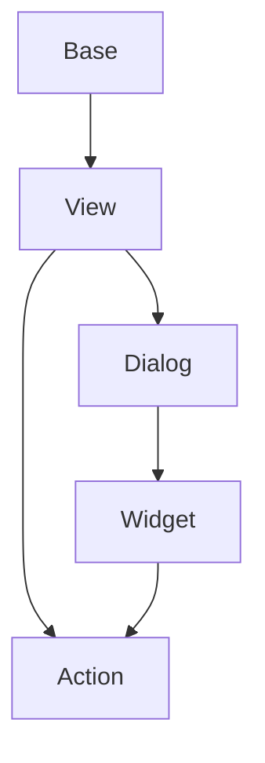

# Documentation
decore Base is a "Python to Vue.js" open source package that helps you go from idea to view in a few simple steps. It is aimed at those who want to focus on the results of their algorithms, do scientific work, perform teaching or learning functions.

decore is currently a work in progress and is only available for Windows. It is not yet ready for production.

The recommended IDE is Visual Studio Code and also all my comments and documentation here will refer to vscode only.

## Get started
### Installation
To install decore Base run the following command, in your terminal, in the project root directory:

```
pip install decore-Base
```

### Usage
Create a new file named ``app.py`` in your project root directory.

To use decore Base, import it into your project:

```
from decore_base import decore
```
To create a new decore application instance, use a ``@decore.app`` decorated function in the app.py file after the line ``if __name__ == '__main__':```.

```
if __name__ == '__main__':
    @decore.app(p_title='My App')
    def main():
        pass
```

### Preperation
The preparation command creates all the needed auxiliary files in your app root directory.

To prepare your app, run ``` python app.py prepare ``` in your project root directory. Use the terminal in vscode.

### Development
To develop your application, use your debugger with the ``` [dev] decore base development ``` profile in vscode.

### Build
To build your application, use your debugger with the ``` [bld] decore Base build ``` profile in vscode.

### Run
To run your application, run ``` python app.py ``` in your project root directory. Use the terminal in vscode.

## Sample
To understand how Decore base works, it is best to look at the Sample application. The application represents my ongoing development of decore base.

To synchronize the sample application to its root directory run ``python app.py sample`` in your project root directory. Use the terminal in vscode or another IDE.

To run the sample application after synchronization, use your debugger with the profile ``[smp] decore base sample ``` in vscode.

## Explanations

#### Base
The base is basically the carrier element for views. It can get views from the same base or views from other bases. The Base is always linked to a Model.

#### Model
The model defines the data to work with. It can be a simple data model or a complex data model. Each model is linked to a Base and is based on peewee ORM. To learn more about peewee ORM, visit [peewee](http://docs.peewee-orm.com/en/latest/).

## Api reference
To create a GUI with decore Base, you decorate functions in the source code according to the default of the execution process. which must be imported before with ``from decore_base import decore``.

The decore module contains those functions that are needed when creating the metadata for the decore front application.

To understand the general approach, synchronize the sample application with the command ``python app.py sample`` in your project root directory.

### @decor.app()
### @decor.base()
### @decor.view()
### @decor.dialog()
### @decor.widget()
### @decor.action()

## Model reference
To make working with the original Peewee model even easier, some functions have been added to the model.

!DESCRIPTION FOLLOWS!

## Component processing


# Notes
This documentation was translated from German to English using github Copilot.