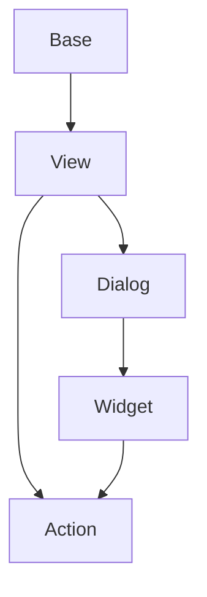

# Documentation
decore Base is a "Python to Vue.js" open source package that helps you get from idea to view in a few simple steps. It is aimed at those who want to focus on the results of their algorithms, work scientifically, perform teaching or learning functions.

decore is still under development and only available for Windows at the moment. It is not yet ready for production.

The recommended IDE is Visual Studio Code.

## Get started
### Installation
To install decore Base run the following command in your terminal in the project root directory:

```
pip install decore_base
````
### Usage
Create a new file named ```app.py``` in your project root directory.

To use decore Base import it in your project:

```
from decore_base import decore
```
To create a new decore application instance use a ```decore``` decorated function in app.py file after the ```if __name__ == '__main__':``` line.

```
if __name__ == '__main__':
    @decore.app(p_title='My App')
    def main():
        pass
```

### Preperation
The preparation command creates all the necessary helper files in your app root directory.

To prepare your application run ``` python.exe app.py prepare ``` in your project root directory. Use Terminal in vscode or any other IDE.

### Development
to develop your application use your debugger with profile ``` Decore app dev ``` in vscode.

#### Base
The base is the carrier for views. it can be carry views from same base or views from other bases. The base is also linked with one model.

#### Model
The model defines the data to work with. It can be a simple data model or a complex data model. Each model is linked to a base and is based on peewee ORM. To learn more about peewee ORM visit [peewee](http://docs.peewee-orm.com/en/latest/).

### Build
to build your application use your debugger with profile ``` Decore app build ``` in vscode.

### Run

## Sample
To understand how decore Base works, it is best to look at the sample application. The application represents my constant development of decore Base.

To start the sample application use your debugger with profile ``` Decore app sample ``` in vscode.

## Api reference

## Model Referenz
To further simplify working with the original peewee model, the model has been extended with some functions.

## Component processing


# Notes
This documentation was translated from German to English using github Copilot.