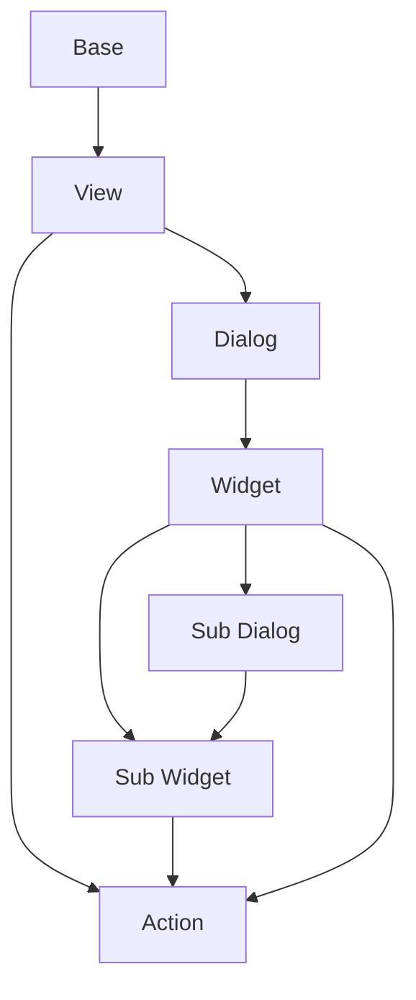

# Documentation Deutsch
decore Base ist ein "Python to Vue.js"-Open-Source-Paket, das Ihnen hilft, in wenigen einfachen Schritten von der Idee zur Ansicht zu gelangen. Es richtet sich an diejenigen, die sich auf die Ergebnisse ihrer Algorithmen konzentrieren wollen, wissenschaftlich arbeiten, Lehr- oder Lernfunktionen durchführen wollen.

decore ist im Moment noch in Arbeit und nur für Windows verfügbar. Es ist noch nicht bereit für die Produktion.

Die empfohlene IDE ist Visual Studio Code.

## Get started
### Installation
Um decore Base zu installieren führen Sie folgenden Befehl, in Ihrem Terminal, im Projektstammverzeichnis aus:

```
pip install decore_base
````

### Usage
Erstellen Sie eine neue Datei mit dem Namen ```app.py``` in Ihrem Projektstammverzeichnis.

Um decore Base zu verwenden, importieren Sie es in Ihr Projekt:

```
from decore_base import decore
```
Um eine neue Decore-Anwendungsinstanz zu erstellen, verwenden Sie eine ```decore``` dekorierte Funktion in der Datei app.py nach der Zeile ```if __name__ == '__main__':```.

```
if __name__ == '__main__':
    @decore.app(p_title='My App')
    def main():
        pass
```

### Preperation
Der Vorbereitungsbefehl erstellt alle benötigten Hilfsdateien in Ihrem App-Stammverzeichnis.

Um Ihre Anwendung vorzubereiten, führen Sie ``` python app.py prepare ``` in Ihrem Projektstammverzeichnis aus. Verwenden Sie Terminal in vscode oder einer anderen IDE.

### Development
Um Ihre Anwendung zu entwickeln, verwenden Sie Ihren Debugger mit dem Profil ``` Decore app dev ``` in vscode.

#### Base
Die Base ist im prinzip das Trägerelement für Views. Sie kann Views von derselben Base oder Views von anderen Bases bekommen. Die Base ist immer mit einem Model verknüpft.

#### Model
Das Model definiert die Daten mit denen gearbeitet wird. Es kann ein einfaches Datenmodell oder ein komplexes Datenmodell sein. Jedes Model ist mit einer Base verknüpft und basiert auf peewee ORM. Um mehr über peewee ORM zu erfahren, besuchen Sie [peewee](http://docs.peewee-orm.com/en/latest/).

### Build
Um Ihre Anwendung zu erstellen, verwenden Sie Ihren Debugger mit dem Profil ``` Decore app build ``` in vscode.

### Run

## Sample
Um die Funktionsweise von Decore base zu verstehen, ist es am besten, sich die Sample-Anwendung anzuschauen. Die Anwendung repräsentiert meine ständige Weiterentwicklung von decore Base.

Um die Sample-Anwenundung zu starten, verwenden Sie Ihren Debugger mit dem Profil ``` Decore app sample ``` in vscode.

## Api reference

## Model Referenz
Um die Arbeit mit dem originalen Peewee-Model noch weiter zu vereinfachen, wurde das Model um einige funktionen erweitert.

## Komponentenverarbeitung


# Anmerkungen
Diese Dokumentation wurde mit github Copilot aus dem deustchen ins englische übersetzt.

[]: # Path: readme_en_de.md

# Documentation English
decore Base is a "Python to Vue.js" open source package that helps you get from idea to view in a few simple steps. It is aimed at those who want to focus on the results of their algorithms, work scientifically, perform teaching or learning functions.

decore is still under development and only available for Windows at the moment. It is not yet ready for production.

The recommended IDE is Visual Studio Code.

## Get started
### Installation
To install decore Base run the following command in your terminal in the project root directory:

```
pip install decore_base
````
### Usage
Create a new file named ```app.py``` in your project root directory.

To use decore Base import it in your project:

```
from decore_base import decore
```
To create a new decore application instance use a ```decore``` decorated function in app.py file after the ```if __name__ == '__main__':``` line.

```
if __name__ == '__main__':
    @decore.app(p_title='My App')
    def main():
        pass
```

### Preperation
The preparation command creates all the necessary helper files in your app root directory.

To prepare your application run ``` python app.py prepare ``` in your project root directory. Use Terminal in vscode or any other IDE.

### Development
to develop your application use your debugger with profile ``` Decore app dev ``` in vscode.

#### Base
The base is the carrier for views. it can be carry views from same base or views from other bases. The base is also linked with one model.

#### Model
The model defines the data to work with. It can be a simple data model or a complex data model. Each model is linked to a base and is based on peewee ORM. To learn more about peewee ORM visit [peewee](http://docs.peewee-orm.com/en/latest/).

### Build
to build your application use your debugger with profile ``` Decore app build ``` in vscode.

### Run

## Sample
To understand how decore Base works, it is best to look at the sample application. The application represents my constant development of decore Base.

To start the sample application use your debugger with profile ``` Decore app sample ``` in vscode.

## Api reference

## Model Referenz
To further simplify working with the original peewee model, the model has been extended with some functions.

## Component processing


# Notes
This documentation was translated from German to English using github Copilot.